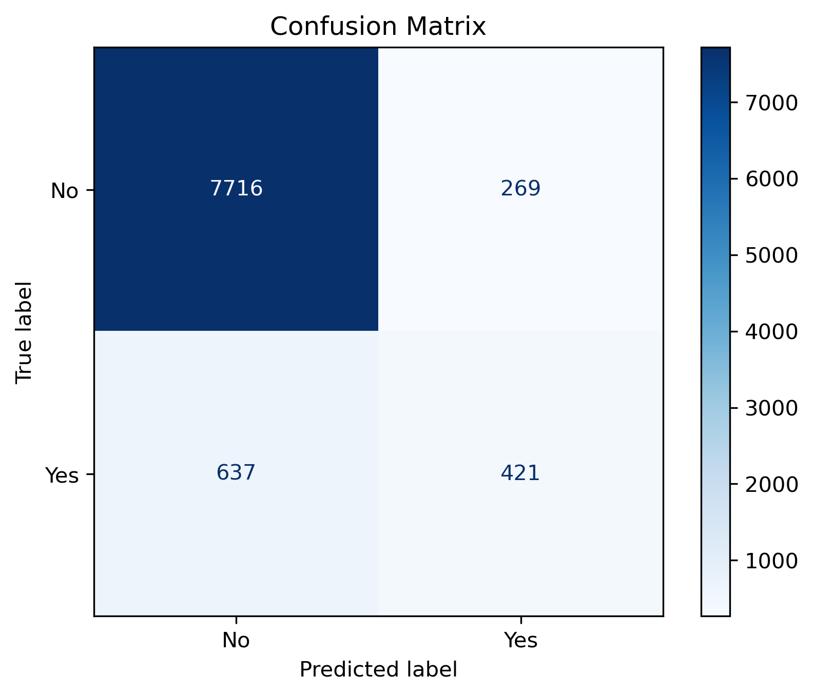
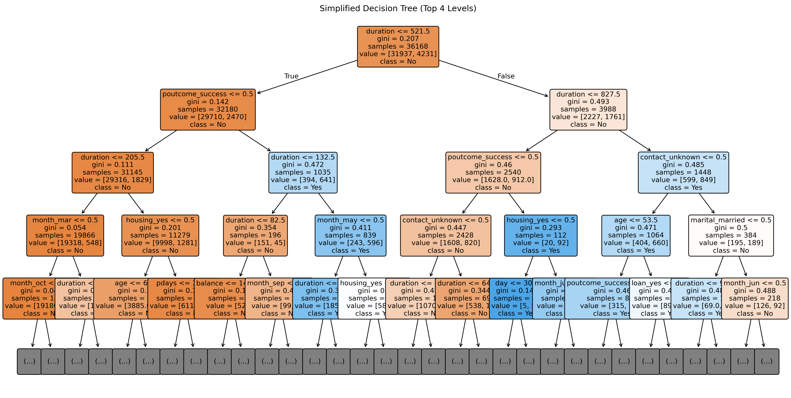

# Task 3 – Decision Tree Classifier | Prodigy Infotech (Data Science Internship)

This repository contains the implementation of a **Decision Tree Classifier** to predict whether a customer will subscribe to a term deposit, based on demographic and behavioral data. This task is part of my **Data Science Internship at Prodigy Infotech**.

---

## Objective

> **Build a Decision Tree Classifier to predict whether a customer will purchase a product or service using the Bank Marketing Dataset from UCI ML Repository.**

---

## Dataset

- **File Used**: `bank-full.csv`
- **Source**: [UCI Bank Marketing Dataset](https://archive.ics.uci.edu/ml/datasets/Bank+Marketing)
- **Records**: 45,211 rows × 17 columns
- **Target**: `y` → whether the customer subscribed to a term deposit (`yes`/`no`)

---

## Preprocessing

- Converted target variable `y` into binary: `yes` → 1, `no` → 0
- One-hot encoded all categorical variables
- Performed **stratified train-test split** (80% train, 20% test)

---

## Model: Decision Tree Classifier

| Parameter     | Value     |
|---------------|-----------|
| Criterion     | Gini      |
| Max Depth     | 10        |
| Random State  | 42        |

---

## Evaluation Metrics

| Metric     | Score    |
|------------|----------|
| Accuracy   | 89.98%   |
| Precision  | 61.01%   |
| Recall     | 39.79%   |
| F1 Score   | 48.17%   |


---

## Visualizations

### Confusion Matrix  


### Simplified Decision Tree (Top 4 Levels)  


---

## Key Observations

- Model achieves high overall accuracy (89.98%)
- Recall and F1-score improved significantly by increasing tree depth to 10
- Most important features include `duration`, `poutcome`, `month`, and `contact`
- Confusion matrix shows a good balance between true positives and false positives

---

## Project Structure

```bash
├── bank/
│   └── bank-full.csv
├── assets/
│   ├── confusion_matrix.png
│   └── tree_top4.png
├── DS_03.ipynb
└── README.md
